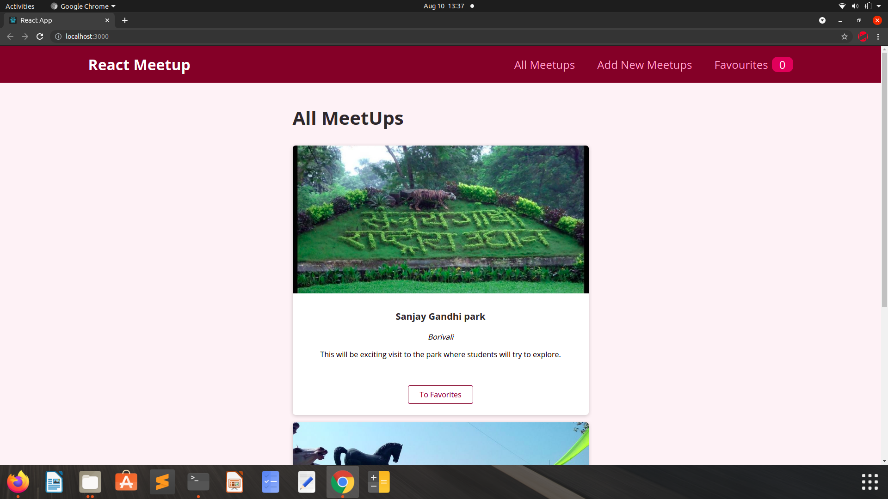
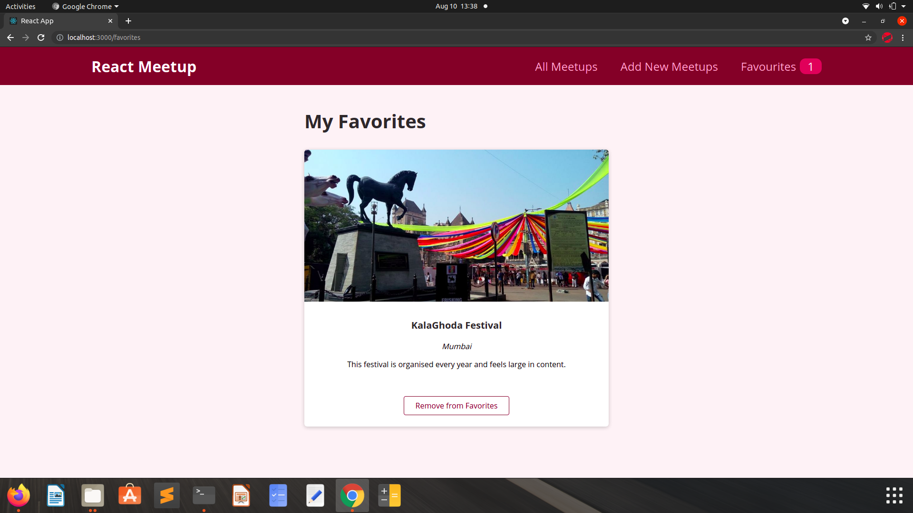
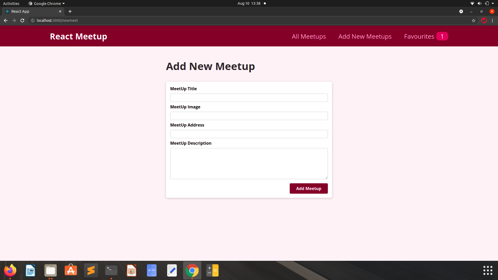

# Meetup

This project is about Meetup list for the users.
## Installation

Install my-project as zip or clone.

```bash
    git clone https://github.com/Yesh123456/react-pro.git
```

Install npm.(For Ubuntu)

```bash
     sudo apt-get install npm
```
Run the npm in folder.

```bash
    npm install
```

Run the app.

```bash
    npm start
```

Create a Firebase Realtime project and copy json link inside Dashbord/Realtime Database.
Fetch needs to change. 
```bash
cd src/pages/Allmeetup.js
fetch('https://react-pro-started-default-rtdb.firebaseio.com/meetups.json')
```
## Features

- Red/White Scheme
- Live previews
- Responsive app
- Web Application

  
## Screenshots








## Feedback

If you have any feedback, please reach out to us at isco30427@gmail.com

  
## Badges

Add badges from somewhere like: [shields.io](https://shields.io/)

[](https://github.com/tterb/atomic-design-ui/blob/master/LICENSEs)
[](https://opensource.org/licenses/)
[](http://www.gnu.org/licenses/agpl-3.0)

  
